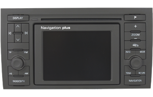
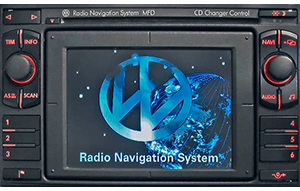
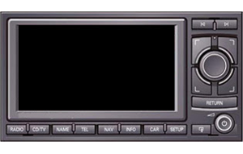
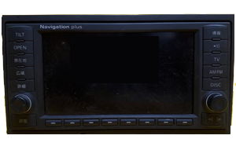
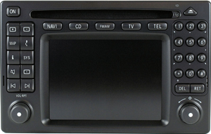
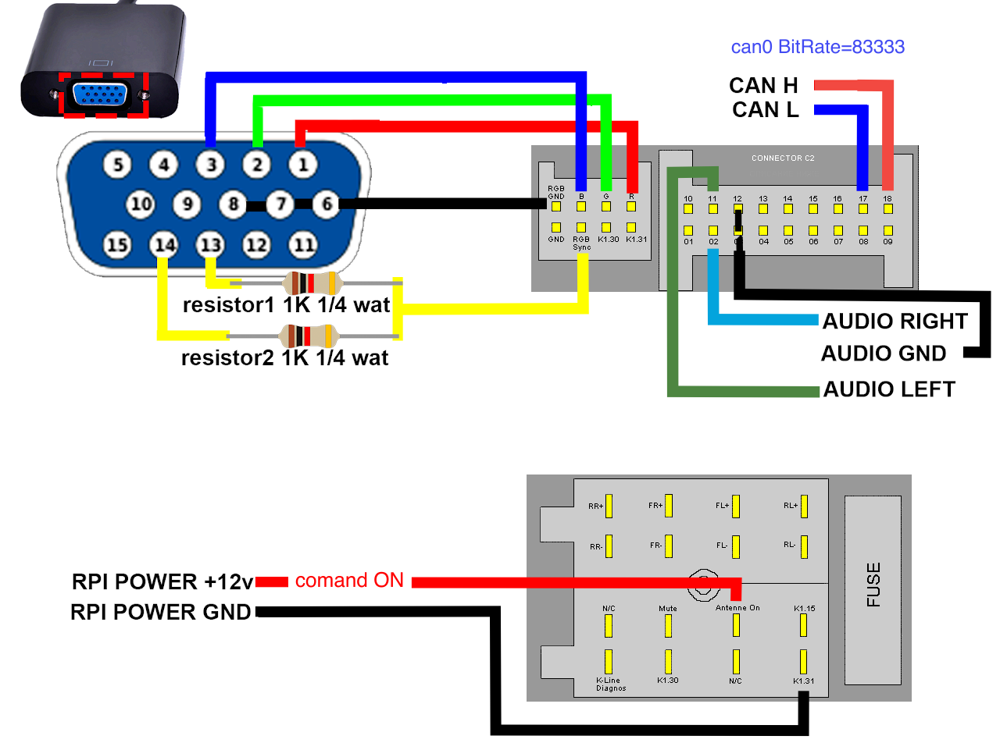

### Auto install
```bash
wget -P /tmp https://raw.githubusercontent.com/maltsevvv/repository/master/install.sh
sudo bash /tmp/install.sh
```
---

  

[](https://downloads.raspberrypi.com/raspios_oldstable_lite_arm64/images/raspios_oldstable_lite_arm64-2025-10-02/2025-10-01-raspios-bookworm-arm64-lite.img.xz)
[](https://github.com/maltsevvv/repository/raw/refs/heads/master/kodi20/skin.rnspi/skin.rnspi-20.1.2.zip) ✅ stable version
---
-blue?logo=raspberrypi&logoColor=red)
[](https://github.com/maltsevvv/repository/raw/refs/heads/master/kodi21/skin.rnspi/skin.rnspi-21.1.2.zip) ‼️test version

[](https://github.com/maltsevvv/repository/raw/refs/heads/master/repository.rnspi.zip)

## Last version *.1.2 
<details>
   <summary><strong>Changes</strong></summary>
  <p>1.2</p>
  <ul>
    <li> - Add timing change for long press button:<br><br> For RNSD, RNS-MFD ["0.2", "0.4", "0.6", "0.8", "1"]<br>Settings ➡️ Interface ➡️ Skin ➡️ -Configure skin... ➡️ Control ➡️ - long press for RNSD, MFD: 0.4 sec.<br><br>For RNSE, COMMAND 2.0 ["2", "4", "6", "8", "10"]<br>Settings ➡️ Interface ➡️ Skin ➡️ -Configure skin... ➡️ Control ➡️ - long press for RNSE, COMMAND: 4 msg.</li>
  </ul>
  <p>1.1</p>
  <ul>
    <li> - Added the ability to choose the color of a button when it is selected<br>Settings ➡️ Interface ➡️ Skin ➡️ -Configure skin... ➡️ Background/Colour ➡️ Edit Background colour Buttons</li>
  </ul>
  <p>1.0</p>
  <ul>
    <li> - Fix show time (24)</li>
    <li> - Fix show rpm</li>
    <li> - Add control MB Command 2.0</li>
    <li> - For MB Command 2.0, long press '>' 2sec.</li>
  </ul>
  
  <p>0.9</p>
  <ul>
    <li> - Access to repository updates has been changed. To update, while in the Add-ons section, press the left arrow in the interface.</li>
  </ul>
  <p>0.8</p>
  <ul>
    <li> - Added control for RNS MFD</li>
    <li> - Changed the logic of the RNSE buttons. Long press > 10 messages</li>
    <li> - Added display of internet connection on the home screen, without the option to disable it</li>
    <li> - Changed the display of RPI CPU temp</li>
    <li> - Changed everything and added it to settings</li>
    <li> - CAN interface settings, now in the skin interface settings</li>
    <li> - Removed the CAN menu from the HOME menu</li>
  </ul>
</details>

---
1. [Detailed information on the website](https://sites.google.com/view/rnspi/)
2. [Minimum set of components](https://github.com/maltsevvv/repository/wiki)
3. [Wiring diagram for connecting modules to the Raspberry PI](#raspberry-PI-connect-modules)
4. [Connection diagram of modules with VAG RNS](#connect-to-vag-rns)
5. [Connect diagram of modules withe Mercedes COMMAND 2.0](#connect-to-mercedes-command-20)
6. [Configuring CAN data display](#configuring-can-data-display)
5. [Control buttons](#control-button-rns)
7. [Bluetooth](#bluetooth)
    - [Add device](#bluetooth_add)
    - [Remove a previously connected device](#bluetooth_del)
    - [Checking usb bluetooth adapter](#bluetooth-usb-adapter)
8. [There is no image on the PC monitor or home TV.](#not-image-monitor-or-tv)
  
---
### Configuring CAN data display   
CanBus interface settings   
`Settings ➡️ Interface ➡️ Skin ➡️ -Configure skin...` or open `Skin Settings`

To update Repository   
`Settings ➡️ Add-ons ➡️ PRESS LEFT ➡️ Check for Updates`

To update to a new version of RNSPI from the Repository   
`Settings ➡️ Add-ons ➡️ Install from repository ➡️ Repository RNSPI ➡️ Look and feel ➡️ Skin ➡️ Skin RNSPI ➡️ Version`

Disabling HDMI-CEC notification on boot  
`Settings ️➡️ System ➡️ Input ➡️ Peripherals ➡️ CEC Adapter ➡️ Switch source to this device on startup OFF ❌` 

For RNS-D  
`Settings ➡️ Interface ➡️ Skin ➡️ -Configure skin... ➡️ Emulation ➡️ Emulation TV-tuner RNSD ✅`  
`Settings ➡️ Interface ➡️ Skin ➡️ -Configure skin... ➡️ Control ➡️ RNSD Control ✅`

For RNS-E  
`Settings ➡️ Interface ➡️ Skin ➡️ -Configure skin... ➡️ Emulation ➡️ Emulation TV-tuner RNSE ✅`  
`Settings ➡️ Interface ➡️ Skin ➡️ -Configure skin... ➡️ Control ➡️ RNSE Control ✅`

For RNS-MFD  
`Settings ➡️ Interface ➡️ Skin ➡️ -Configure skin... ➡️ Emulation ➡️ Emulation TV-tuner RNSD ✅`  
`Settings ➡️ Interface ➡️ Skin ➡️ -Configure skin... ➡️ Control ➡️ MFD Control ✅`

For Mercedes Command 2.0  
`Settings ➡️ Interface ➡️ Skin ➡️ -Configure skin... ➡️ Emulation ➡️ Emulation TV-tuner RNSD ✅`  
`Settings ➡️ Interface ➡️ Skin ➡️ -Configure skin... ➡️ Control ➡️ Command 2.0 Control ✅`

For RNS-JP3  
`Settings ➡️ Interface ➡️ Skin ➡️ -Configure skin... ➡️ Control ➡️ RNS-JP3 Control ✅`  

---

### RNS control button, versions *.1.2 and newer

|   RNSE   |   RNSD   |    MFD    | COMMAND |  time  |   KODI   |
|----------|----------|-----------|--------|--------|----------|
| 🔘 ↪️ ↩️  | 🔘 ↪️ ↩️  | 🔘 ↪️ ↩️   | 🔘 ↪️ ↩️ |        | 🔼 / 🔽    |
| | | | | | |
| 🔘 press | 🔘 press,  | 🔘 press,  | 🔘 press,  | < 1sec | 🆗   |
| 🔘 press | 🔘 press,  | 🔘 press,  | 🔘 press,  | > 1sec | Context Menu / 🎦 OSD |  
| | | | | | |
|  |  |  |   | < 1sec | 🔼       |
|  |  |  |  | > 1sec | 🎦,🎵 Big Skip Forward |
| | | | | | |
|  |  |  |  | < 1sec | 🔽     | 
|  |  |  |  | > 1sec | 🎦,🎵 Big Skip Backward |
| | | | | | |
|  |  |  | ,  | < 1sec | ◀️     |  
|  |  |  | ,  | > 1sec | 🎦,🎵,BT ⏮️ |
| | | | | | |
|  |  |  | ,    | < 1sec | ▶️     |
|  |  |  | ,    | > 1sec | 🎦,🎵,BT ⏭️ |
| | | | | | |
|  |  | ,   |   | < 1sec | BACK      |
|  |  | ,   |  | > 1sec | 🎦,🎵 ⏹️, BT Disconnect |
| | | | | | |
|  |  | ,  |  | < 1sec | Context Menu / 🎦 OSD |  
|  |  | ,  |  | > 1sec | Skin Settings |
| | | | | | |
|          |  |  |  | < 1sec | 🎦,🎵 Small Skip Forward |  
|          |  |  |  | > 1sec | 🎦,🎵 Big Skip Forward | 
| | | | | | |
|          |  |  |  | < 1sec | 🎦,🎵 Small Skip Backward |  
|          |  |  |  | > 1sec | 🎦,🎵 Big Skip Backward |  
| | | | | | |

---


### Control button RNS to version *.1.1 (old)

|   RNSE   |   RNSD   |    MFD    |  MB 2.0 |  time  |   KODI   |
|----------|----------|-----------|--------|--------|----------|
| 🔘 ↪️ ↩️  | 🔘 ↪️ ↩️  | 🔘 ↪️ ↩️   | 🔘 ↪️ ↩️ |        | 🔼 🔽    |
| | | | | | |
| 🔘 press | 🔘 press | 🔘 press | 🔘 press | < 1sec | Select   |
| 🔘 press | 🔘 press | 🔘 press | 🔘 press | > 1sec | C.Menu / 🎦 OSD |  
| | | | | | |
| ⬛🔼    | UP        | 4        | 2         | < 1sec | Up       |
| ⬛🔼    | UP        | 4        | 2         | > 1sec | 🎦🎵+skeep Big |
| | | | | | |
| ⬛🔽    | DOWN      | 5        | 8         | < 1sec | Down     | 
| ⬛🔽    | DOWN      | 5        | 8         | > 1sec | 🎦🎵-skeep Big |
| | | | | | |
| Previous | LEFT      | Previous | 4         | < 1sec | Left     |  
| Previous | LEFT      | Previous | 4         | > 1sec | 🎦🎵Prev, BT Prev |
| | | | | | |
| Next     | RIGHT     | Next     | 6         | < 1sec | Right     |
| Next     | RIGHT     | Next     | 6         | > 1sec | 🎦🎵Next, BT Next |
| | | | | | |
| RETURN   | RETURN    | Exit     | RET       | < 1sec | Back      |
| RETURN   | RETURN    | Exit     | RET       | > 1sec | 🎦🎵Stop, BT Disconnect |
| | | | | | |
| SETUP    | MODE      | 6        | 0         | < 1sec | C.Menu / 🎦 OSD |  
| SETUP    | MODE      | 6        | 0         | > 1sec | Skin Settings |
| | | | | | |
|          | AS        | AS       | 5         | < 1sec | Select    |
|          | AS        | AS       | 5          | > 1sec | C.Menu / 🎦 OSD | 
| | | | | | |
|          | +         | 1        | Next      | < 1sec | 🎦🎵Next, BT Next |  
| | | | | | |
|          | -         | 2        | Previous  | < 1sec | 🎦🎵Prev, BT Prev |  
| | | | | | |
|          |           | 3        |            | < 1sec | Back      |  
|          |           | 3        |            | > 1sec | 🎦🎵Stop |  
| | | | | | |
|          |           |          | 1          | < 1sec | 🎦🎵+skeep Small |  
|          |           |          | 1          | > 1sec | 🎦🎵+skeep Big |  
| | | | | | |  
|          |           |          | 7          | < 1sec | 🎦🎵-skeep Small |  
|          |           |          | 7          | > 1sec | 🎦🎵-skeep Big |  
---

## Bluetooth  

### Bluetooth add device  
##### Connecting to Bluetooth should work without any problems, but sometimes it doesn't work, so you have to connect manually.
```bash
sudo bluetoothctl
```
```bash
scan on
```
```bash
connect 00:00:00:00:00:00
```
```bash
trust 00:00:00:00:00:00
```
##### Replace `00:00:00:00:00:00` with your device's MAC.
---
### Bluetooth_del devices  
```bash
sudo bluetoothctl
```
```bash
devices
```
```bash
remove 00:00:00:00:00:00
```
##### Replace `00:00:00:00:00:00` with your device's MAC.  
---
### Bluetooth usb adapter
1. Checking usb bluetooth adapter
```bash
hciconfig
```
`hci1:   Type: Primary  Bus: UART` >>> ***built-in Bluetooth adapter***  
`    BD Address: E4:5F:01:0D:3A:45  ACL MTU: 1021:8  SCO MTU: 64:1`  
`    UP RUNNING PSCAN ISCAN` >>> ***works***  
`    RX bytes:3780 acl:0 sco:0 events:397 errors:0`  
`    TX bytes:67416 acl:0 sco:0 commands:397 errors:0`  

`hci0:   Type: Primary  Bus: USB` >>> ***external USB Bluetooth adapter***  
`    BD Address: 00:1A:7D:DA:71:13  ACL MTU: 679:8  SCO MTU: 48:16`  
`    DOWN` >>> ***doesn't work***  
`    RX bytes:3322355 acl:5664 sco:0 events:277 errors:0`  
`    TX bytes:5985 acl:187 sco:0 commands:71 errors:0`  

The USB Bluetooth adapter is detected as "hci0", so it needs to be unlocked.  


2. Check if it is blocked at the soft level  
```bash
rfkill list
```
`0: hci0: Bluetooth`  
`    Soft blocked: yes` >>> ***blocked*** 
`    Hard blocked: no`  

3. Unblock  
```bash
sudo rfkill unblock all
```
4. Check  
```bash
rfkill list
```
`0: hci0: Bluetooth`  
`    Soft blocked: no` >>> ***USB Bluetooth unlocked***  
`    Hard blocked: no`  

5. [Let's go back to point 1 and check](#bluetooth-usb-adapter)

6. Disable built-in UART Bluetooth 
```bash
echo -e "\ndtoverlay=disable-bt" | sudo tee -a /boot/firmware/config.txt
```

7. Check which sound card you have selected
```bash
cat /proc/asound/cards
```
8. If you only have one card, we see `0`, everything is fine:  
`0 [sndrpihifiberry]: RPi-simple - snd_rpi_hifiberry_dac`  
`                      snd_rpi_hifiberry_dac`  

9. If you have a different card, change `0` to your card number in `/etc/asound.conf`:
```bash
sudo nano /etc/asound.conf
```
---

## Raspberry PI connect modules  
❎ It is recommended to use MCP2515 with SN65HVD230 for Raspberry, as the module operates from 3.3v.  
❌ It is not recommended to use the MCP2515 with TJA1050 for Raspberry without modifications, as the module operates from 5v.  
 

---
## Connect to VAG RNS
   
   
   
 

---

## Connect to Mercedes Command 2.0
 

---

## Not image monitor or tv
This happens because the resolution required for display on RNS* is 480i. Most modern devices don't support this resolution.
To fix this, you can temporarily modify the Raspberry Pi configuration file.
```bash
cd
wget https://github.com/maltsevvv/repository/raw/refs/heads/master/driver/video.sh
sudo chmod +x video.sh
```
run script
```bash
sudo bash video.sh
```
