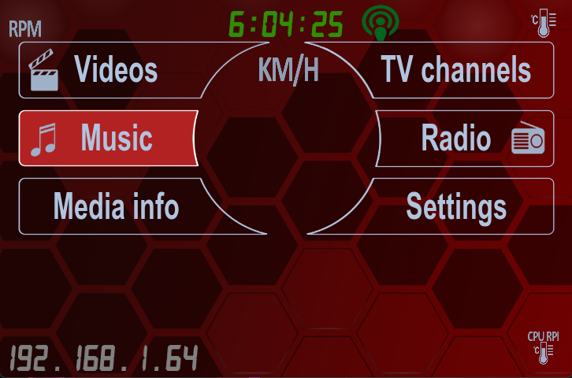
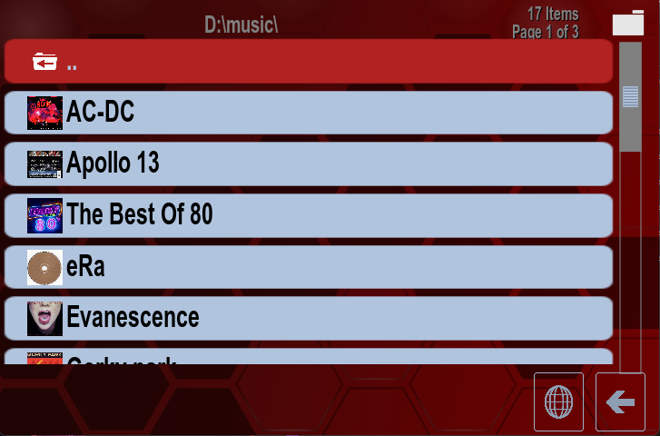
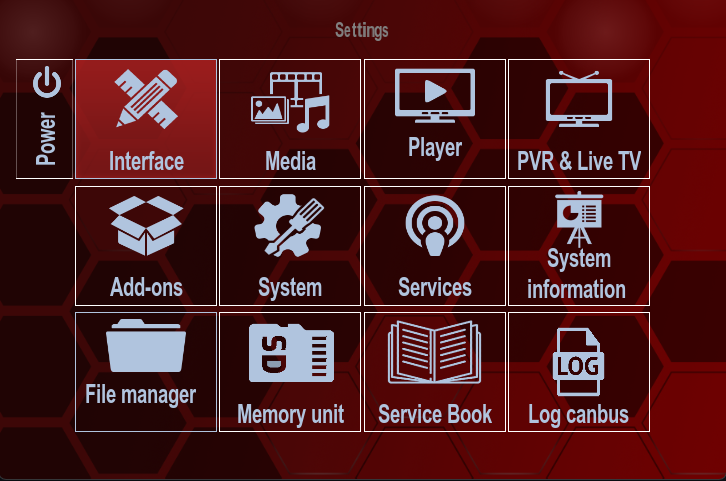
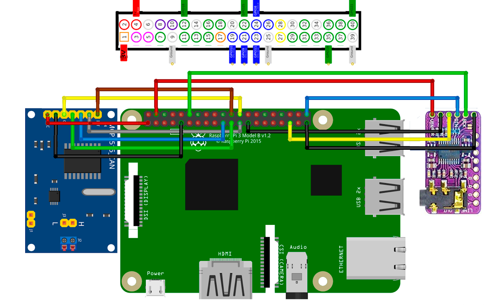
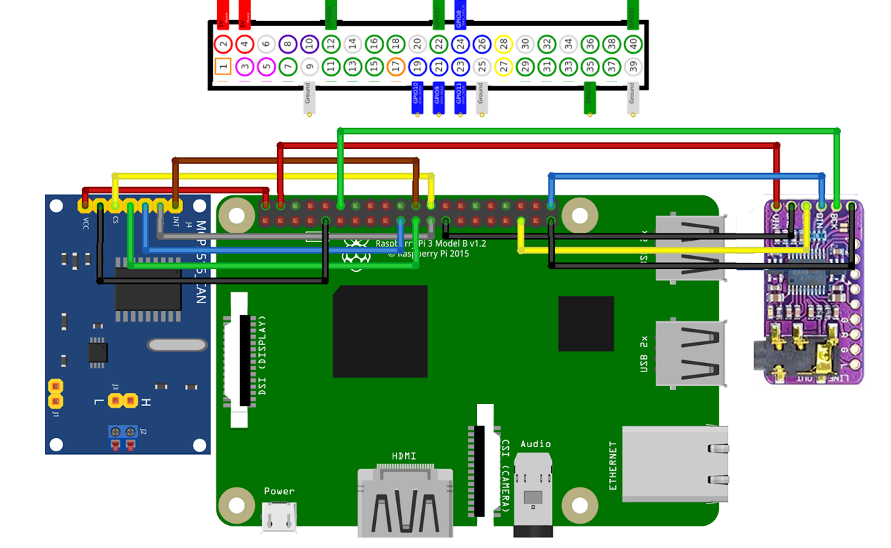
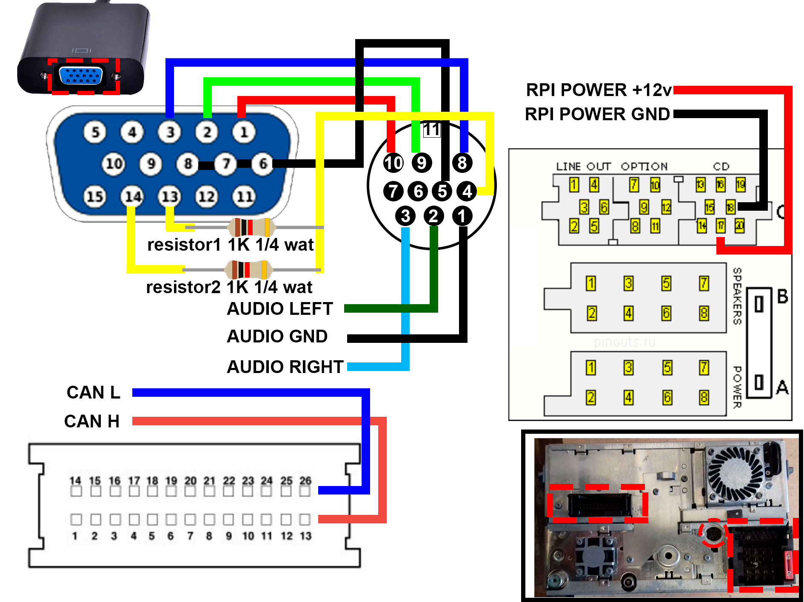
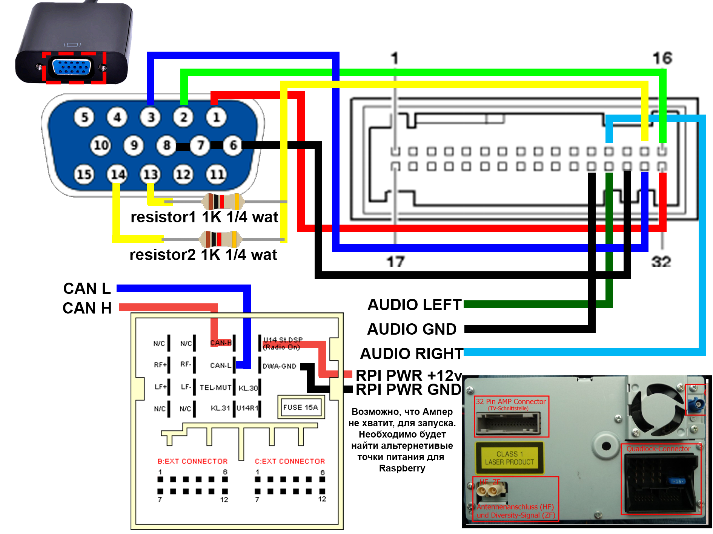
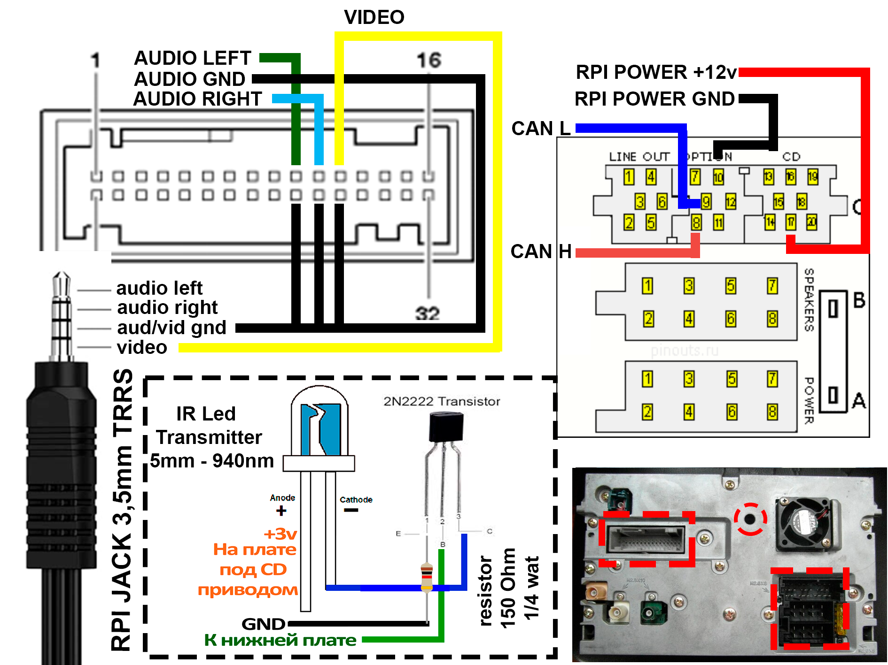

  

[](https://downloads.raspberrypi.com/raspios_oldstable_lite_arm64/images/raspios_oldstable_lite_arm64-2025-10-02/2025-10-01-raspios-bookworm-arm64-lite.img.xz)
[](https://github.com/maltsevvv/repository/raw/refs/heads/master/kodi20/skin.rnspi/skin.rnspi-20.0.8.zip) ✅ stable version
---
-blue?logo=raspberrypi&logoColor=red)
[](https://github.com/maltsevvv/repository/raw/refs/heads/master/kodi21/skin.rnspi/skin.rnspi-21.0.8.zip) ‼️test version
---
[](https://github.com/maltsevvv/repository/raw/refs/heads/master/repository.rnspi.zip)
---
## last version *️⃣.0️⃣.8️⃣

### Auto install
```bash
wget -P /tmp https://raw.githubusercontent.com/maltsevvv/repository/master/install.sh
sudo bash /tmp/install.sh
```
---
[Подробная информация на сайте](https://sites.google.com/view/rnspi/)
---

1. [Схема соединения модулей с Raspberry PI](#raspberry-PI-connect-modules)
2. [Схема соединения модулей с RNS](#connect-to-rns)
3. [Настройка отображения данных CAN](#settings-can-interfaces)
4. [Кнопки управления](#control-button-rns)
5. [Bluetooth]
    - [Добавить устройство](#bluetooth_add)
    - [Удалить ранее подключенное устройство](#bluetooth_del)
    - [Проверка usb bluetooth адаптера](#bluetooth_usb)
6. [Нет изображения на мониторе или домашнем телевизоре](#not-image-monitor-or-tv)
  
---
### Settings Can Interfaces
Настройки интерфейса CAN перенесены в   
`Settings ➡️ Interface ➡️ Skin ➡️ -Configure skin...` or open `Skin Settings`

Отключение оповещения HDMI-CEC при загрузке  
`Settings ️➡️ System ➡️ Input ➡️ Peripherals ➡️ CEC ➡️ Enable OFF`  

---

### Control button RNS

|   RNSE   |   RNSD   |        |  KODI  |
| -------- | ---------|--------|--------|
| 🔘 ↪️ ↩️ | 🔘 ↪️ ↩️  |        | 🔼 🔽 |
|          |          |        |        |
| 🔘 press | 🔘 press | < 1sec | Select |
| 🔘 press | 🔘 press | > 1sec | C.Menu / 🎦 OSD |  
|           |          |       |        |
| ⬛🔼     | UP       | < 1sec | Up    |
| ⬛🔼     | UP       | > 1sec | 🎦+20min |
|           |          |        |        |
| ⬛🔽     | DOWN     | < 1sec | Down   | 
| ⬛🔽     | DOWN     | > 1sec | 🎦-20min |
|           |          |        |        |
| Previous  | LEFT     | < 1sec | Left     |  
| Previous  | LEFT     | > 1sec | 🎦Prev |
|           |          |        |        |
| Next      | RIGHT    | < 1sec | Right  |
| Next      | RIGHT    | > 1sec | 🎦Next |
|           |          |        |        |
| RETURN    | RETURN   | < 1sec | Back   |
| RETURN    | RETURN   | > 1sec | 🎦Stop |
|           |          |        |        |
| SETUP     | MODE     | < 1sec | C.Menu / 🎦 OSD |  
| SETUP     | MODE     | > 1sec | Skin Settings |
|           |          |        |        |
|           | AS       | < 1sec | Select |
|           | AS       | > 1sec | C.Menu / 🎦 OSD | 
---

## Bluetooth  

### Bluetooth_add device  
##### К Bluetooth должены подключаться без проблем, но иногда не получается, и по этому нужно подключать вручную
```bash
sudo bluetoothctl
```
```bash
scan on
```
```bash
connect 00:00:00:00:00:00
```
```bash
trust 00:00:00:00:00:00
```
##### Вместо `00:00:00:00:00:00`, указываем свой mac устройства
---
### Bluetooth_del devices  
```bash
sudo bluetoothctl
```
```bash
devices
```
```bash
remove 00:00:00:00:00:00
```
##### Вместо `00:00:00:00:00:00`, указываем свой mac устройства
---
### Bluetooth_usb adapter
```bash
hciconfig
```
`hci1:   Type: Primary  Bus: UART` >>> ***встроенный bluetooth адаптер***  
`    BD Address: E4:5F:01:0D:3A:45  ACL MTU: 1021:8  SCO MTU: 64:1`  
`    UP RUNNING PSCAN ISCAN` >>> ***работает***  
`    RX bytes:3780 acl:0 sco:0 events:397 errors:0`  
`    TX bytes:67416 acl:0 sco:0 commands:397 errors:0`  

`hci0:   Type: Primary  Bus: USB` >>> ***внешний usb bluetooth адаптер***  
`    BD Address: 00:1A:7D:DA:71:13  ACL MTU: 679:8  SCO MTU: 48:16`  
`    DOWN` >>> ***не работает***  
`    RX bytes:3322355 acl:5664 sco:0 events:277 errors:0`  
`    TX bytes:5985 acl:187 sco:0 commands:71 errors:0`  

usb bluetooth адаптер, опредилися на `hci0`. Значит его нужно разблокировать  


2. Проверяем, не заблакирован ли он, на уровне soft  
```bash
rfkill list
```
`0: hci0: Bluetooth`  
`    Soft blocked: yes` >>> ***заблокирован***  
`    Hard blocked: no`  

3. Разблокируем его  
```bash
sudo rfkill unblock all
```
4. Проверяем  
```bash
rfkill list
```
`0: hci0: Bluetooth`  
`    Soft blocked: no` >>> ***usb bluetooth разблокирован***  
`    Hard blocked: no`  

5. Повторная проверка usb bluetooth адаптер  
```bash
hciconfig
```
`hci1:   Type: Primary  Bus: UART` >>> ***встроенный bluetooth адаптер***  
`    BD Address: E4:5F:01:0D:3A:45  ACL MTU: 1021:8  SCO MTU: 64:1`  
`    DOWN` >>> ***не работает***  
`    RX bytes:3780 acl:0 sco:0 events:397 errors:0`  
`    TX bytes:67416 acl:0 sco:0 commands:397 errors:0`  

`hci0:   Type: Primary  Bus: USB` >>> ***внешний usb bluetooth адаптер***  
`    BD Address: 00:1A:7D:DA:71:13  ACL MTU: 679:8  SCO MTU: 48:16`  
`    UP RUNNING PSCAN ISCAN` >>> ***работает***  
`    RX bytes:3322355 acl:5664 sco:0 events:277 errors:0`  
`    TX bytes:5985 acl:187 sco:0 commands:71 errors:0`  

6. Отключить встроенный UART Bluetooth 
```bash
echo -e "\ndtoverlay=disable-bt" | sudo tee -a /boot/firmware/config.txt
```
7. Сразу проверяем, какая аудио карта у Вас выбрана
```bash
cat /proc/asound/cards
```
Если видим `0`, то все OK:  
`0 [sndrpihifiberry]: RPi-simple - snd_rpi_hifiberry_dac`  
`                      snd_rpi_hifiberry_dac`  

Если, Ваша карта другая, то меняем, `0` на номер Вашей карты в `/etc/asound.conf`:
```bash
sudo nano /etc/asound.conf
```
---
## Raspberry PI connect modules  
❎ Рекомендуется использовать, MCP2515 с SN65HVD230 для Raspberry т.к модуль работает от 3.3v.  
❌ Не рекомендуется использовать, MCP2515 с TJA1050 для Raspberry без доработок, т.к модуль работает от 5v.  
 

---
## Connect to RNS
 

---

## Not image monitor or tv
Это происходит, т.к. разрешение необходимое для отображения на магнитолах RNS*, должно передаваться в разрешении 480i. Большинство современных устроиств не поддерживают, такое разрешение.
Что бы, это исправить, можно временно изменить файл конфигурации raspberry.
```bash
cd
wget https://github.com/maltsevvv/repository/raw/refs/heads/master/driver/video.sh
sudo chmod +x video.sh
```
Запускаем
```bash
sudo bash video.sh
```
Если хотим отобразить на TV или Мониторе PC `TV`
